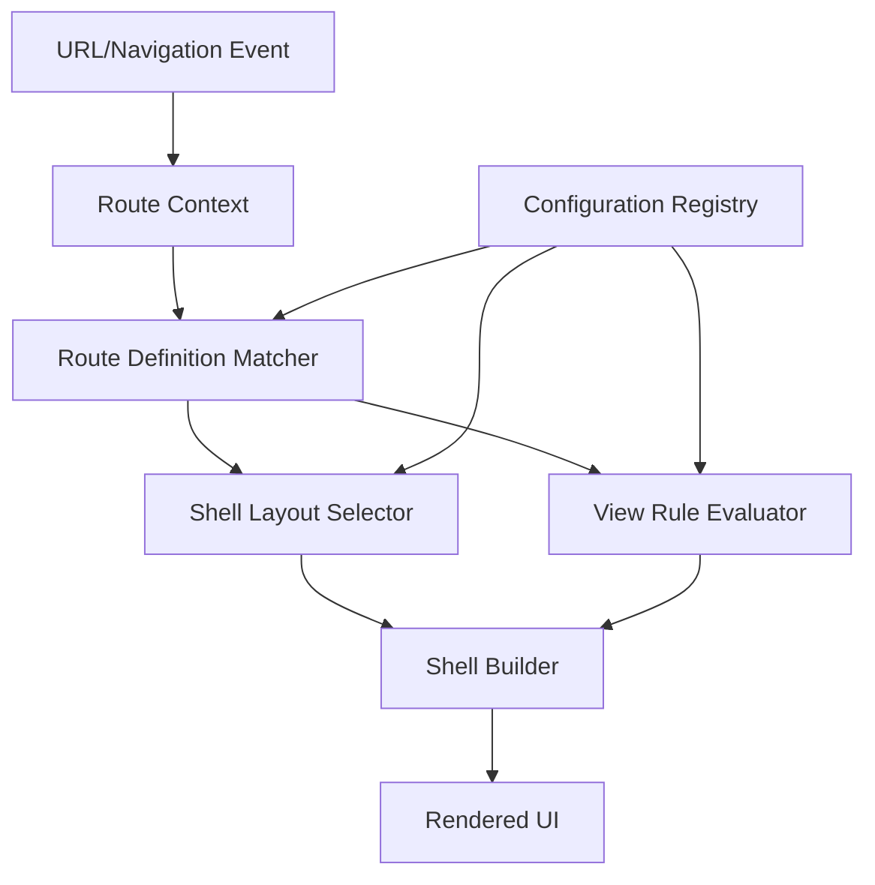

# Design Document

## Overview

Mosaique is a Flutter package that provides a declarative, rule-based system for managing multi-region page layouts. The core design philosophy centers on separating layout structure (shell layouts) from content (views) and using developer-defined rules to dynamically determine both based on navigation context.

The system operates on three key abstractions:

1. **Shell Layouts**: Widget templates that define the spatial arrangement of region placeholders
2. **Route Definitions**: Declarative specifications that map URL patterns to shell layouts and view injection rules
3. **View Injection Rules**: Conditional logic that determines which widgets appear in which regions based on route context

When navigation occurs, Mosaique evaluates the current route against all registered route definitions, selects the matching shell layout, evaluates view injection rules for each region, and constructs the final screen. The system is designed to be router-agnostic, with adapters available for popular routing libraries like go_router.

## Architecture

### High-Level Architecture



### Component Responsibilities

**Route Context**: Immutable data structure containing the current URL path, path parameters, query parameters, and any additional navigation state.

**Configuration Registry**: Central registry that stores all shell layout definitions, route definitions, and view injection rules. Provides validation during registration and lookup during navigation.

**Route Definition Matcher**: Evaluates the current Route Context against all registered route definitions to find the best match based on pattern specificity.

**Shell Layout Selector**: Determines which shell layout to use based on the matched route definition and current Route Context.

**View Rule Evaluator**: For each region in the selected shell layout, evaluates all view injection rules to determine which widget should be rendered.

**Shell Builder**: Constructs the final widget tree by combining the shell layout with the resolved views for each region.

### Data Flow

1. Navigation event occurs (URL change, programmatic navigation, deep link)
2. Route Context is created/updated with current navigation state
3. Route Definition Matcher finds the matching route definition
4. Shell Layout Selector retrieves the appropriate shell layout
5. For each region in the shell layout:
   - View Rule Evaluator evaluates all rules for that region
   - Highest priority matching rule is selected
   - Widget Builder function is invoked to create the view
6. Shell Builder combines shell layout with resolved views
7. Flutter renders the final widget tree

## Components and Interfaces

### Core Data Models

```dart
/// Immutable representation of current navigation state
class RouteContext {
  final String path;
  final Map<String, String> pathParameters;
  final Map<String, String> queryParameters;
  final Map<String, dynamic> extra;
  
  RouteContext({
    required this.path,
    this.pathParameters = const {},
    this.queryParameters = const {},
    this.extra = const {},
  });
}

/// Defines a shell layout with region placeholders
class ShellLayout {
  final String id;
  final Widget Function(Map<String, Widget> regions) builder;
  
  ShellLayout({
    required this.id,
    required this.builder,
  });
}

/// Defines a route with shell and view selection rules
class RouteDefinition {
  final String pattern;
  final ShellLayoutSelector shellSelector;
  final List<ViewInjectionRule> viewRules;
  
  RouteDefinition({
    required this.pattern,
    required this.shellSelector,
    required this.viewRules,
  });
}

/// Determines which shell layout to use
typedef ShellLayoutSelector = String Function(RouteContext context);

/// Condition function that determines if a rule applies
typedef ConditionFunction = bool Function(RouteContext context);

/// Creates a widget for a region
typedef WidgetBuilder = Widget Function(RouteContext context);

/// Rule for injecting a view into a specific region
class ViewInjectionRule {
  final String regionKey;
  final ConditionFunction condition;
  final WidgetBuilder builder;
  final int priority;
  
  ViewInjectionRule({
    required this.regionKey,
    required this.condition,
    required this.builder,
    this.priority = 0,
  });
}
```

### Configuration Registry

```dart
class MosaiqueRegistry {
  final Map<String, ShellLayout> _shellLayouts = {};
  final List<RouteDefinition> _routes = [];
  final Map<String, WidgetBuilder> _defaultBuilders = {};
  
  /// Register a shell layout
  void registerShellLayout(ShellLayout layout);
  
  /// Register a route definition
  void registerRoute(RouteDefinition route);
  
  /// Register a default widget builder for a region key
  void registerDefaultBuilder(String regionKey, WidgetBuilder builder);
  
  /// Validate all registrations
  void validate();
  
  /// Find matching route for given context
  RouteDefinition? matchRoute(RouteContext context);
  
  /// Get shell layout by ID
  ShellLayout? getShellLayout(String id);
  
  /// Get default builder for region key
  WidgetBuilder? getDefaultBuilder(String regionKey);
}
```

### Route Matching

```dart
class RouteMatcher {
  /// Find the best matching route for the given context
  RouteDefinition? match(
    List<RouteDefinition> routes,
    RouteContext context,
  );
  
  /// Calculate specificity score for a route pattern
  int calculateSpecificity(String pattern, String path);
  
  /// Extract path parameters from URL based on pattern
  Map<String, String> extractPathParameters(
    String pattern,
    String path,
  );
}
```

### View Resolution

```dart
class ViewResolver {
  /// Resolve which widget should be rendered for a region
  Widget? resolveView(
    String regionKey,
    List<ViewInjectionRule> rules,
    RouteContext context,
    WidgetBuilder? defaultBuilder,
  );
  
  /// Find the highest priority matching rule
  ViewInjectionRule? findMatchingRule(
    String regionKey,
    List<ViewInjectionRule> rules,
    RouteContext context,
  );
}
```

### Shell Builder

```dart
class MosaiqueShellBuilder extends StatefulWidget {
  final RouteContext context;
  final MosaiqueRegistry registry;
  
  @override
  State<MosaiqueShellBuilder> createState() => _MosaiqueShellBuilderState();
}

class _MosaiqueShellBuilderState extends State<MosaiqueShellBuilder> {
  late RouteDefinition _currentRoute;
  late ShellLayout _currentShell;
  late Map<String, Widget> _resolvedViews;
  
  @override
  void didUpdateWidget(MosaiqueShellBuilder oldWidget) {
    // Detect changes and rebuild only affected regions
  }
  
  Widget _buildRegion(String regionKey);
  
  @override
  Widget build(BuildContext context) {
    return _currentShell.builder(_resolvedViews);
  }
}
```

### Router Integration

```dart
/// Abstract interface for router adapters
abstract class MosaiqueRouterAdapter {
  /// Get current route context
  RouteContext getCurrentContext();
  
  /// Listen to route changes
  Stream<RouteContext> get onRouteChanged;
  
  /// Navigate to a new route
  void navigate(String path, {
    Map<String, String>? pathParameters,
    Map<String, String>? queryParameters,
  });
  
  /// Navigate back
  void goBack();
}

/// go_router adapter implementation
class GoRouterAdapter implements MosaiqueRouterAdapter {
  final GoRouter router;
  
  GoRouterAdapter(this.router);
  
  @override
  RouteContext getCurrentContext() {
    // Extract context from GoRouter state
  }
  
  @override
  Stream<RouteContext> get onRouteChanged {
    // Convert GoRouter events to RouteContext stream
  }
  
  @override
  void navigate(String path, {
    Map<String, String>? pathParameters,
    Map<String, String>? queryParameters,
  }) {
    // Use GoRouter.go or GoRouter.push
  }
  
  @override
  void goBack() {
    router.pop();
  }
}
```

### Context Access

```dart
/// InheritedWidget for accessing route context and navigation
class MosaiqueScope extends InheritedWidget {
  final RouteContext routeContext;
  final MosaiqueRouterAdapter router;
  
  const MosaiqueScope({
    required this.routeContext,
    required this.router,
    required super.child,
  });
  
  static MosaiqueScope? maybeOf(BuildContext context) {
    return context.dependOnInheritedWidgetOfExactType<MosaiqueScope>();
  }
  
  static MosaiqueScope of(BuildContext context) {
    final scope = maybeOf(context);
    assert(scope != null, 'No MosaiqueScope found in context');
    return scope!;
  }
  
  @override
  bool updateShouldNotify(MosaiqueScope oldWidget) {
    return routeContext != oldWidget.routeContext;
  }
}

/// Extension for convenient access
extension MosaiqueContextExtension on BuildContext {
  RouteContext get routeContext => MosaiqueScope.of(this).routeContext;
  MosaiqueRouterAdapter get mosaiqueRouter => MosaiqueScope.of(this).router;
}
```

## Data Models

### Route Pattern Syntax

Route patterns follow a path-template syntax similar to popular routing libraries:

- Static segments: `/users/profile`
- Path parameters: `/users/:userId/posts/:postId`
- Wildcard: `/docs/*`
- Optional segments: `/users/:userId?`

### Region Key Convention

Region keys are string identifiers used to reference regions in shell layouts and view injection rules. Common conventions:

- `main`: Primary content area
- `sidebar`: Side navigation or auxiliary content
- `header`: Top navigation or title bar
- `footer`: Bottom content
- `details`: Detail panel or inspector
- `modal`: Overlay content

Developers are free to define their own region keys based on application needs.

### Priority System

When multiple view injection rules match for a region, priority determines which rule wins:

- Higher priority values take precedence
- Default priority is 0
- Negative priorities are allowed
- If priorities are equal, the first registered rule wins

## C
orrectness Properties

*A property is a characteristic or behavior that should hold true across all valid executions of a system—essentially, a formal statement about what the system should do. Properties serve as the bridge between human-readable specifications and machine-verifiable correctness guarantees.*

After analyzing the acceptance criteria, several properties are redundant or can be combined. For example:
- Properties 8.1 and 8.2 both test selective rebuilding and can be combined into one comprehensive property
- Properties about API acceptance (1.1, 1.2, 2.1, 2.2, 2.3, 3.1, 3.2, 9.1) test similar behavior and can be consolidated
- Properties 4.3 and 4.4 both test parameter passing and can be combined

The following properties represent the unique, non-redundant correctness guarantees:

### Property 1: Shell layout registration and retrieval
*For any* shell layout with a unique identifier, registering it and then retrieving it by that identifier should return an equivalent shell layout.
**Validates: Requirements 1.1, 1.4**

### Property 2: Route matching specificity
*For any* set of overlapping route patterns and a given URL path, the route matcher should always select the most specific matching pattern.
**Validates: Requirements 2.5**

### Property 3: View injection rule priority
*For any* region with multiple matching view injection rules, the rule with the highest priority value should be selected.
**Validates: Requirements 3.4**

### Property 4: Path parameter extraction
*For any* route pattern with path parameters and a matching URL, extracting parameters should produce a map where all parameter names from the pattern are keys.
**Validates: Requirements 4.1**

### Property 5: Query parameter extraction
*For any* URL with query parameters, parsing should produce a map containing all query parameter key-value pairs.
**Validates: Requirements 4.2**

### Property 6: Parameter availability in condition functions
*For any* condition function evaluation, all path and query parameters extracted from the route context should be accessible within the condition function.
**Validates: Requirements 4.3, 4.4**

### Property 7: Route context update triggers resolution
*For any* route context change, shell layout and view resolution should be triggered regardless of whether the change came from a URL change, programmatic navigation, or adapter event.
**Validates: Requirements 5.5, 6.5, 7.3**

### Property 8: Selective region rebuilding
*For any* navigation that changes only a subset of region views, only those regions with changed views should rebuild their widget subtrees.
**Validates: Requirements 8.1, 8.2, 8.4**

### Property 9: Full rebuild on shell layout change
*For any* navigation that changes the shell layout, the entire screen should rebuild with the new layout.
**Validates: Requirements 8.3**

### Property 10: State preservation during partial rebuilds
*For any* region that is not affected by a navigation change, its widget state should be preserved after the navigation completes.
**Validates: Requirements 8.5**

### Property 11: Default builder fallback
*For any* region where no conditional rules match and a default builder is configured, the default builder should be invoked to create the view.
**Validates: Requirements 9.2, 9.5**

### Property 12: Shell layout validation
*For any* route definition that references a shell layout identifier, validation should fail if that shell layout has not been registered.
**Validates: Requirements 10.1, 10.5**

### Property 13: Parameter propagation through nesting
*For any* nested shell layout, route parameters should be accessible to all views in the nested regions.
**Validates: Requirements 11.3**

### Property 14: Selective nested region rebuilding
*For any* nested region update, only the affected nested region should rebuild without triggering rebuilds of parent regions.
**Validates: Requirements 11.4**

### Property 15: Route context consistency
*For any* point in time, all views accessing the route context should receive identical route context information.
**Validates: Requirements 12.2, 12.5**

### Property 16: Route context reactivity
*For any* view that depends on route context, when the route context changes, the view should be notified and rebuilt.
**Validates: Requirements 12.4**

## Error Handling

### Configuration Errors

**Invalid Shell Layout Reference**: When a route definition references a non-existent shell layout ID, validation should fail with a clear error message indicating which route and which shell layout ID is invalid.

**Circular Nesting Detection**: When processing nested layouts, the system should detect circular references (e.g., Shell A contains Shell B which contains Shell A) and throw an error before infinite recursion occurs.

**Missing Required Parameters**: When a widget builder expects certain route parameters that are not present in the route context, the system should either use default values if provided or throw a descriptive error.

### Runtime Errors

**Route Matching Failure**: When no route definition matches the current route context and no default route is configured, the system should render a configurable "not found" widget or throw an error based on developer configuration.

**Widget Builder Exceptions**: When a widget builder function throws an exception, the system should catch it, log the error, and render an error widget in that region without crashing the entire application.

**Adapter Communication Errors**: When a router adapter fails to communicate with the underlying routing library, the system should log the error and attempt to maintain the last known good state.

### Error Recovery

The system should implement graceful degradation:

1. If a single region's view fails to build, render an error widget in that region only
2. If shell layout resolution fails, fall back to a default shell layout if configured
3. If view resolution fails for a region, fall back to the default builder for that region
4. Maintain error boundaries around each region to prevent cascading failures

### Validation Modes

**Strict Mode**: All validation errors cause immediate exceptions during configuration. Recommended for development.

**Lenient Mode**: Validation warnings are logged but don't prevent execution. Allows runtime recovery. Recommended for production with proper monitoring.

## Testing Strategy

### Unit Testing

Unit tests will verify individual components in isolation:

- **Route Matching**: Test the route matcher with various patterns and URLs to ensure correct matching and specificity calculation
- **Parameter Extraction**: Test path and query parameter extraction with edge cases (special characters, empty values, missing parameters)
- **View Resolution**: Test view rule evaluation with different priorities and conditions
- **Configuration Registry**: Test registration, lookup, and validation of shell layouts and routes
- **Error Handling**: Test that appropriate errors are thrown for invalid configurations

### Property-Based Testing

Property-based tests will verify universal properties across many generated inputs using the `test` package with `package:test_api` for property testing, or a dedicated property testing library like `glados` if available for Dart/Flutter.

Each property-based test should run a minimum of 100 iterations with randomly generated inputs.

Each property-based test must be tagged with a comment explicitly referencing the correctness property from this design document using the format: `**Feature: multi-region-shell-layout, Property {number}: {property_text}**`

Property tests will cover:

- **Property 1**: Generate random shell layouts and verify registration/retrieval round-trip
- **Property 2**: Generate overlapping route patterns and verify specificity ordering
- **Property 3**: Generate multiple rules with random priorities and verify highest priority wins
- **Property 4**: Generate route patterns with parameters and verify extraction completeness
- **Property 5**: Generate URLs with query parameters and verify extraction accuracy
- **Property 6**: Generate route contexts and verify parameter availability in functions
- **Property 7**: Generate route context changes from different sources and verify resolution triggers
- **Property 8**: Generate navigation scenarios and verify selective rebuilding
- **Property 9**: Generate shell layout changes and verify full rebuilds
- **Property 10**: Generate partial navigation changes and verify state preservation
- **Property 11**: Generate scenarios with no matching rules and verify default fallback
- **Property 12**: Generate route definitions with invalid references and verify validation failures
- **Property 13**: Generate nested layouts and verify parameter propagation
- **Property 14**: Generate nested region updates and verify selective rebuilding
- **Property 15**: Generate concurrent context access and verify consistency
- **Property 16**: Generate context changes and verify view notifications

### Integration Testing

Integration tests will verify the system works correctly with actual Flutter widgets and routing libraries:

- Test go_router adapter integration with real go_router instances
- Test deep linking scenarios with complete URL navigation
- Test nested shell layouts with real widget trees
- Test state preservation across navigation with stateful widgets
- Test error boundaries and recovery in realistic failure scenarios

### Widget Testing

Widget tests will verify UI behavior:

- Test that shell layouts render correctly with injected views
- Test that region placeholders receive the correct widgets
- Test that MosaiqueScope provides correct context to descendant widgets
- Test that navigation from within views works correctly

## Implementation Notes

### Performance Considerations

**Route Matching Optimization**: Cache compiled route patterns and specificity scores to avoid recomputation on every navigation.

**Selective Rebuilding**: Use `ValueKey` or custom keys for region widgets to help Flutter's reconciliation algorithm identify which widgets have changed.

**Lazy View Resolution**: Only evaluate view injection rules for regions that are actually visible in the current shell layout.

**Memoization**: Cache resolved views when route context hasn't changed to avoid unnecessary widget builder invocations.

### Flutter Best Practices

**InheritedWidget Usage**: Use `InheritedWidget` (MosaiqueScope) to provide route context and navigation capabilities to the widget tree without prop drilling.

**StatefulWidget for Shell Builder**: Use `StatefulWidget` for the shell builder to maintain state across rebuilds and implement `didUpdateWidget` for efficient change detection.

**BuildContext Safety**: Ensure all BuildContext usage is safe and doesn't reference contexts from unmounted widgets.

**Async Handling**: If widget builders need to perform async operations, provide a mechanism for async builders that show loading states.

### Developer Experience

**Clear Error Messages**: All validation and runtime errors should include:
- What went wrong
- Where it went wrong (route pattern, shell layout ID, region key)
- How to fix it

**Type Safety**: Leverage Dart's type system to catch errors at compile time where possible.

**Documentation**: Provide comprehensive API documentation with examples for common use cases.

**Debug Mode**: Provide a debug mode that logs route matching decisions, view resolution steps, and rebuild information.

### Extensibility

**Custom Matchers**: Allow developers to provide custom route matching logic beyond pattern-based matching.

**Custom Priority Resolvers**: Allow developers to provide custom logic for resolving rule priority conflicts.

**Lifecycle Hooks**: Provide hooks for developers to execute code at key points (before navigation, after resolution, etc.).

**Custom Error Handlers**: Allow developers to provide custom error handling logic for different error types.

## Future Enhancements

### Transitions and Animations

Support animated transitions between views in regions:
- Define transition builders for region changes
- Support different transitions for different navigation types
- Coordinate transitions across multiple regions

### Preloading and Prefetching

Support preloading views before navigation:
- Prefetch data needed by views
- Pre-build widgets for anticipated navigation
- Cache resolved views for common routes

### Analytics Integration

Provide hooks for analytics:
- Track navigation events
- Track view injection decisions
- Track error occurrences

### Developer Tools

Build developer tools for debugging:
- Visual route tree inspector
- Live view injection rule debugger
- Performance profiler for route matching and view resolution

### Server-Side Rendering

Support for Flutter web SSR:
- Serialize route context for server rendering
- Support for hydration after client-side takeover
- SEO-friendly URL handling
